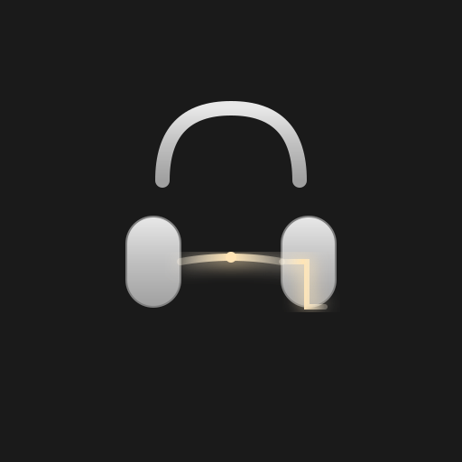
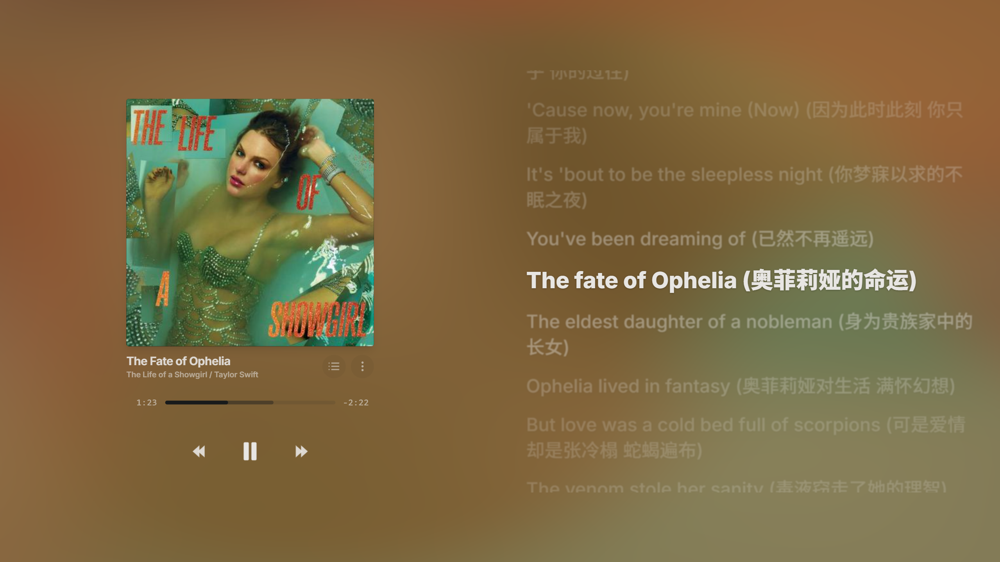
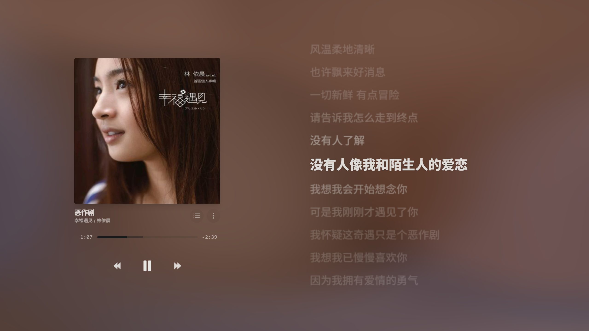

<div align="center">


# Lumison

**A Minimalist Music Player with Immersive Visuals**

Local-first desktop player for imported audio files and local lyrics.

</div>

---

## ✨ Features

### 🎵 Local Music
- **Local Files**: MP3, FLAC, WAV, OGG, M4A, AAC, and more
- **Local Lyrics**: Import embedded lyrics or matching `.lrc` / `.txt` sidecar files
- **Session Queue**: Build and edit a playback queue from local imports

### 🎨 Visual Experience
- **Six Background Modes**: Gradient, Fluid, Melt, Wave, Halo, Swirl
- **Dynamic Theming**: Colors adapt to album artwork
- **Album Art Display**: Full-screen album view with progress bar

### 🎤 Synchronized Lyrics
- **Real-time Sync**: Word-by-word lyrics highlighting
- **Auto-scroll**: Smooth lyrics tracking
- **Click-to-Seek**: Jump to any lyric line

### 🖥️ Desktop Experience
- **Cross-platform**: Windows, macOS, Linux
- **Keyboard Shortcuts**: Full hotkey support
- **Multi-window**: Multi-screen support
- **System Integration**: Media session API and native desktop windows

---

## 📸 Screenshots

<div align="center">





</div>

---

## 🚀 Quick Start

### Local Web Preview

```bash
npm install
npm run dev
```

### Desktop App

```bash
npm install
npm run tauri:dev
npm run tauri:build
```

---

## ⌨️ Keyboard Shortcuts

| Shortcut | Action |
|----------|--------|
| `Space` | Play/Pause |
| `←` / `→` | Previous/Next track |
| `↑` / `↓` | Volume up/down |
| `M` | Mute toggle |
| `P` | Toggle playlist |
| `F` | Toggle fullscreen |
| `L` | Toggle lyrics view |
| `Esc` | Close dialogs |

---

## 🛠️ Development

### Prerequisites

- Node.js 20+
- npm
- Rust toolchain (for desktop builds)

### Commands

```bash
# Development
npm run dev              # Start web dev server
npm run tauri:dev        # Start Tauri dev mode

# Building
npm run build            # Build web version
npm run tauri:build      # Build desktop app

# Testing
npm run test             # Run tests
vitest                   # Watch mode
```

---

## 📁 Project Structure

```
lumison/
├── src/                    # Frontend (React)
│   ├── components/         # UI components
│   │   ├── common/         # Icons, SmartImage, Toast
│   │   ├── navigation/     # App shell navigation
│   ├── modals/         # About and shared dialogs
│   │   └── player/         # Controls, Lyrics, Playlist
│   ├── hooks/              # Custom React hooks
│   ├── services/           # Business logic
│   │   ├── audio/          # Audio processing
│   │   ├── cache/          # IndexedDB caching
│   │   ├── lyrics/         # Lyrics parsing
│   │   ├── music/          # Local music helpers
│   ├── contexts/           # React contexts
│   ├── i18n/               # Internationalization
│   └── utils/              # Utility functions
├── src-tauri/              # Backend (Rust/Tauri)
│   ├── src/                # Rust source
│   └── icons/              # App icons
├── config/                 # Configuration files
├── docs/                   # Documentation
└── public/                 # Static assets
```

---

## 🌐 Tech Stack

| Layer | Technology |
|-------|-----------|
| **Frontend** | React 19, TypeScript 5.8, Vite 6 |
| **Styling** | Tailwind CSS 3.4 |
| **Animation** | @react-spring/web |
| **Desktop** | Tauri 2.0, Rust |
| **Testing** | Vitest |
| **i18n** | Custom (EN/ZH/JA) |

---

## 🌍 Internationalization

Lumison supports multiple languages:
- English
- 中文 (简体)
- 日本語

Switch languages in Settings → Language.

---

## 📄 License

MIT License - see [LICENSE](LICENSE) for details.

---

## 🙏 Credits

- Design inspired by Apple Music
- Local file playback and lyric parsing

---

<div align="center">

Made with ❤️ using React + Tauri

</div>
